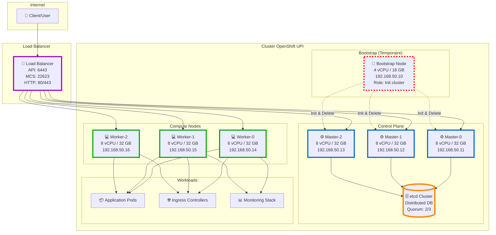
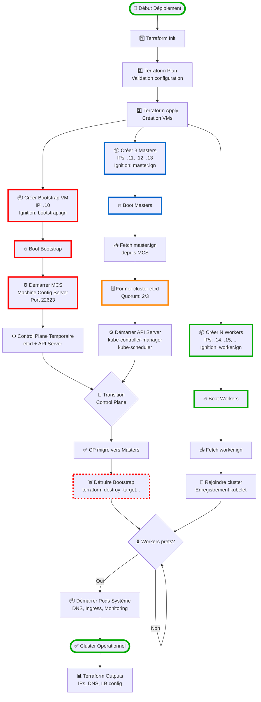
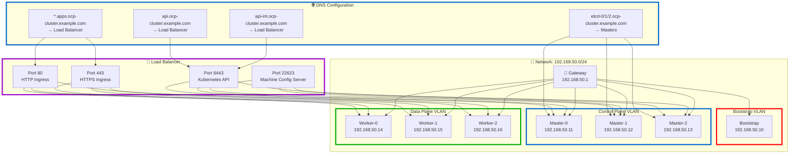
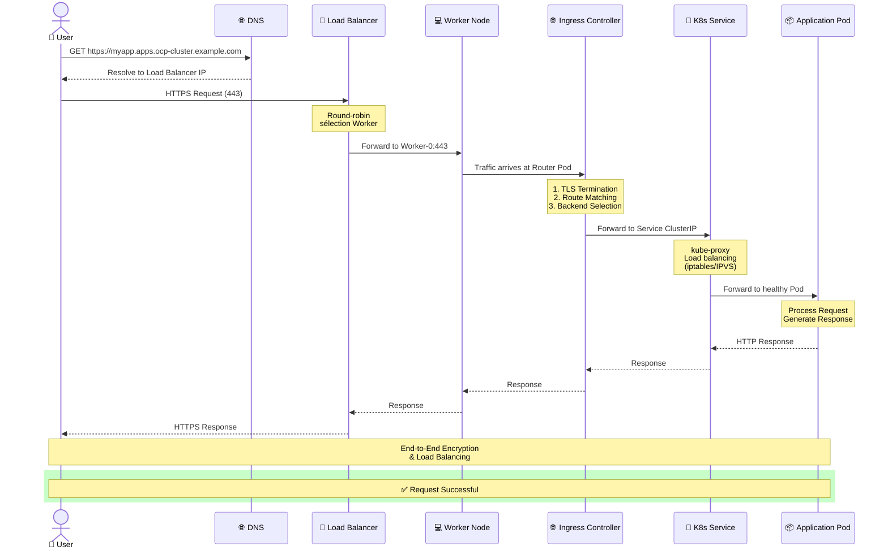
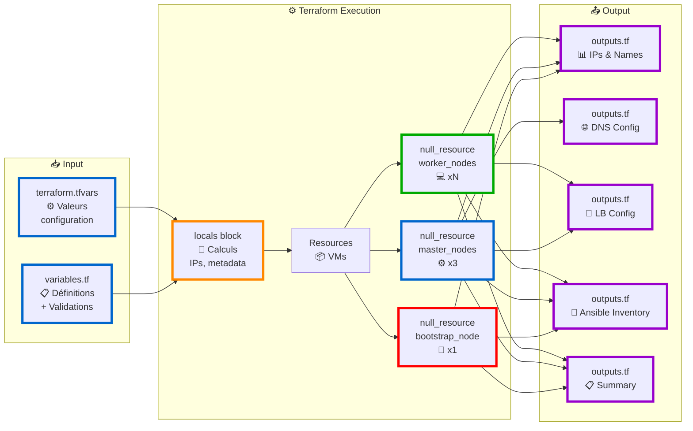
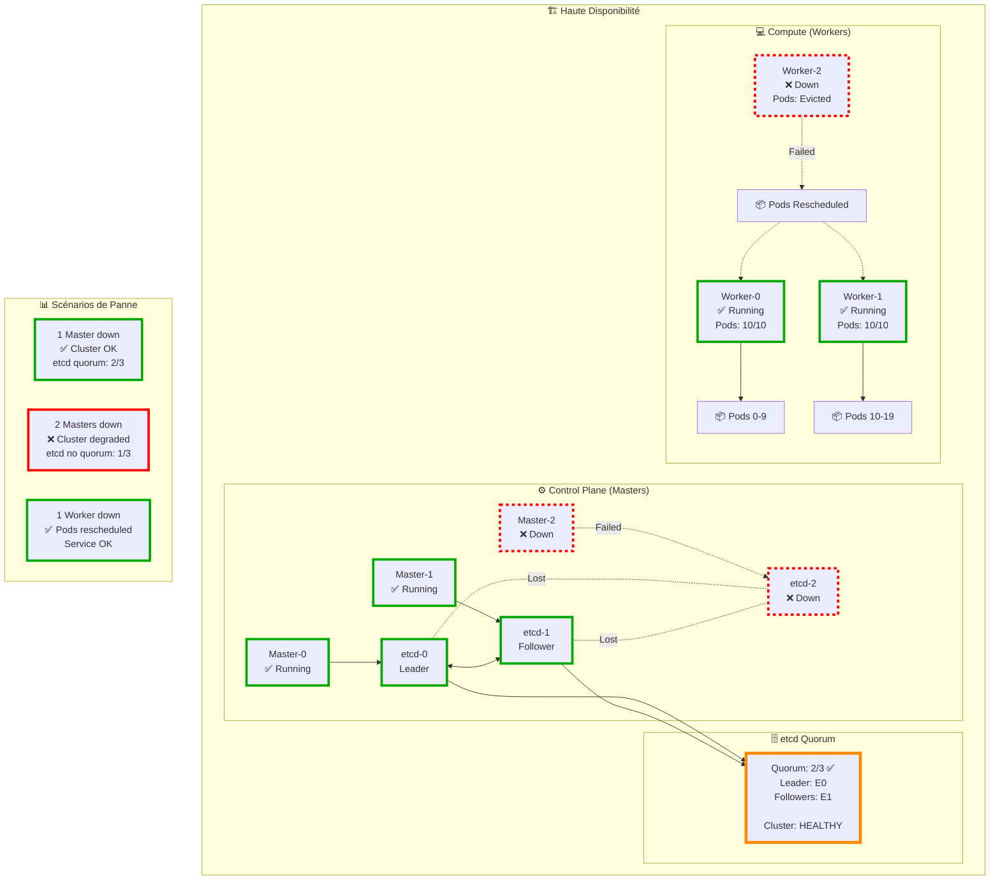
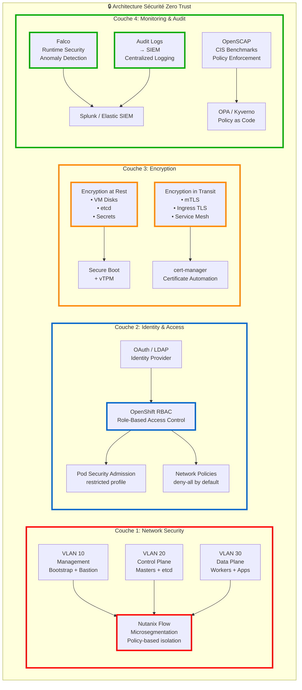
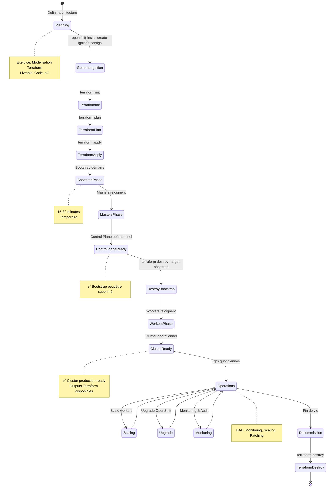

# Diagrammes Mermaid - Architecture OpenShift UPI

Ce fichier contient des diagrammes Mermaid interactifs pour visualiser l'architecture OpenShift UPI et le code Terraform.

> **Note** : Ces diagrammes sont rendus automatiquement sur GitHub, GitLab, et dans la plupart des éditeurs Markdown modernes.

---

## 📊 Table des Matières

1. [Architecture Générale](#1-architecture-générale)
2. [Flux de Déploiement](#2-flux-de-déploiement)
3. [Architecture Réseau](#3-architecture-réseau)
4. [Flux de Requête HTTP](#4-flux-de-requête-http)
5. [Structure Terraform](#5-structure-terraform)
6. [Architecture Haute Disponibilité](#6-architecture-haute-disponibilité)
7. [Sécurité Zero Trust](#7-sécurité-zero-trust)
8. [Lifecycle OpenShift UPI](#8-lifecycle-openshift-upi)

---

## 1. Architecture Générale



**Légende** :
- 🚀 **Bootstrap** (rouge pointillé) : Temporaire, supprimé après installation
- ⚙️ **Masters** (bleu) : Control plane + etcd
- 💻 **Workers** (vert) : Compute nodes
- 🗄️ **etcd** (orange) : Base de données distribuée
- 🔀 **Load Balancer** (violet) : Répartition de charge

---

## 2. Flux de Déploiement



**Phases** :
- **Phase 1** : Terraform (provision VMs)
- **Phase 2** : Bootstrap démarre
- **Phase 3** : Masters forment le cluster
- **Phase 4** : Transition control plane
- **Phase 5** : Workers rejoignent
- **Phase 6** : Cluster opérationnel

---

## 3. Architecture Réseau



---

## 4. Flux de Requête HTTP



---

## 5. Structure Terraform



**Flow** :
1. Variables définies (variables.tf)
2. Valeurs fournies (terraform.tfvars)
3. Calculs dans locals (IPs, noms)
4. Création des ressources VMs
5. Outputs générés (IPs, DNS, LB, etc.)

---

## 6. Architecture Haute Disponibilité



**Tolérance aux pannes** :
- ✅ **1 Master down** : Cluster OK (quorum etcd: 2/3)
- ❌ **2 Masters down** : Cluster degraded (pas de quorum)
- ✅ **1+ Worker down** : Pods reschedulés sur workers sains

---

## 7. Sécurité Zero Trust



**4 Couches de Défense** :
1. 🔴 **Network** : VLANs, microsegmentation
2. 🔵 **Identity** : RBAC, OAuth, pod security
3. 🟠 **Encryption** : At-rest, in-transit, mTLS
4. 🟢 **Monitoring** : Runtime security, audit, compliance

---

## 8. Lifecycle OpenShift UPI



**Phases du Lifecycle** :
1. **Planning** → Architecture design
2. **Generate Ignition** → openshift-install
3. **Terraform** → Provision infrastructure
4. **Bootstrap** → Init cluster (15-30 min)
5. **Masters** → Control plane (30-45 min)
6. **Destroy Bootstrap** → Cleanup
7. **Workers** → Compute nodes (45-60 min)
8. **Operations** → Production
9. **Decommission** → terraform destroy

---

## 📊 Utilisation pour les Présentations

### Recommandations

1. **Sur GitHub** : Les diagrammes s'affichent automatiquement
2. **Pendant la présentation** : Ouvrir ce fichier dans un navigateur
3. **Présentation** :
   - Commencer par le **Diagramme 1** (Architecture générale)
   - Expliquer le flux avec le **Diagramme 2** (Déploiement)
   - Détailler la sécurité avec le **Diagramme 7** (Zero Trust)

### Outils de Rendu

Si GitHub ne rend pas les diagrammes :

- **Mermaid Live Editor** : https://mermaid.live/
- **VS Code** : Extension "Markdown Preview Mermaid Support"
- **Chrome/Firefox** : Extension "Markdown Preview Plus"

### Export en Images

```bash
# Installer mmdc (mermaid-cli)
npm install -g @mermaid-js/mermaid-cli

# Exporter en PNG
mmdc -i DIAGRAMS_MERMAID.md -o diagrams.png
```

---

## 🎨 Légende des Couleurs

Les diagrammes utilisent une palette de couleurs **simples et très contrastées** (bordures épaisses uniquement, sans fond coloré) pour une lisibilité maximale :

| Couleur | Code Hex | Signification | Usage |
|---------|----------|---------------|-------|
| 🔴 **Rouge** | `#FF0000` | Bootstrap / Erreurs | Noeud temporaire ou composants en panne |
| 🔵 **Bleu** | `#0066CC` | Masters / Control Plane | Masters, API, composants de contrôle |
| 🟢 **Vert** | `#00AA00` | Workers / OK | Workers, noeuds compute, états sains |
| 🟠 **Orange** | `#FF8800` | etcd / Attention | Base de données distribuée, warnings |
| 🟣 **Violet** | `#9900CC` | Load Balancer / Outputs | LB, outputs Terraform |

> **Note** : Les couleurs utilisent uniquement des **bordures épaisses (4-5px)** sans fond coloré pour une meilleure lisibilité sur tous les fonds (clair/sombre).

---

**Ces diagrammes sont interactifs sur GitHub et dans la plupart des éditeurs Markdown modernes !**
